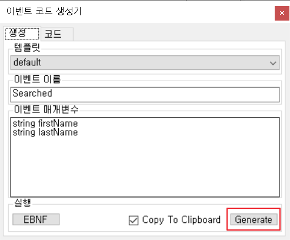

# C# 이벤트 코드 생성기
C# 이벤트 생성할 필요한 일체의 코드를 생성합니다.

-----------------------------------

## 이벤트
C#에서 ~~이벤트 핸들러를 작성하는 것 말고~~ 이벤트를 생성하는 방법에 관한 글은 [여기](http://kimgwajang.tistory.com/5)를 참고하십시오.

-----------------------------------

## 빠른 시작
### Searched 이벤트 코드 생성
* `Searched` 검색 버튼이 클릭되면 발생하는  이벤트. 이벤트 매개변수로 firstName과 lastName이 있음

1. [다운로드](/releases/download/v1.0/EventStuffGenerator.Win.zip) 후 EventStuffGenerator.Win.exe 실행

2. 이벤트 이름과 매개변수 입력 후 코드 생성


  * 이벤트 관련 코드가 클립보드에 복사됨
3. UserControl 작성


4. UserControl에 위에서 생성된 코드 붙여넣기
```csharp
#region Searched event things for C# 3.0
public event EventHandler<SearchedEventArgs> Searched;

protected virtual void OnSearched(SearchedEventArgs e)
{
	if (Searched != null)
		Searched(this, e);
}

private SearchedEventArgs OnSearched(string firstName  , string lastName )
{
	SearchedEventArgs args = new SearchedEventArgs(firstName  , lastName );
    OnSearched(args);

    return args;
}

private SearchedEventArgs OnSearchedForOut()
{
	SearchedEventArgs args = new SearchedEventArgs();
    OnSearched(args);

    return args;
}

public class SearchedEventArgs : EventArgs
{
	public string FirstName { get; set;}  
public string LastName { get; set;} 

	public SearchedEventArgs()
    {
	}
	
	public SearchedEventArgs(string firstName  , string lastName )
    {
		FirstName = firstName;  
LastName = lastName; 
	}
}
#endregion
```
5. Search 버튼의 클릭 이벤트 핸들러에 위에서 만든 이벤트 생성하는 코드 추가
```csharp
private void btnSearch_Click(object sender, EventArgs e)
{
    OnSearched(txbFirstName.Text, txbLastName.Text);
}
```
6. Form에 UserControl 추가


7. UserControl.Searched 이벤트 핸들러 작성


```csharp
private void uscSearch_Searched(object sender, Controls.SearchControl.SearchedEventArgs e)
{
    MessageBox.Show($"My name is {e.FirstName} {e.LastName}");
}
```

### Searching 이벤트 코드 생성
  * `Searching` 검색 하기 전 발생하는 이벤트. 특정 조건 시 이벤트 발생을 취소할 수 있음.

2. 이벤트 이름과 매개변수 입력 후 코드 생성
  * `bool cancel` 매개변수가 추가됨


3. UserControl에 위에서 생성된 코드 붙여넣기
```csharp
#region Searching event things for C# 3.0
public event EventHandler<SearchingEventArgs> Searching;

protected virtual void OnSearching(SearchingEventArgs e)
{
    if (Searching != null)
        Searching(this, e);
}

private SearchingEventArgs OnSearching(string firstName  , string lastName  , bool cancel )
{
    SearchingEventArgs args = new SearchingEventArgs(firstName  , lastName  , cancel );
    OnSearching(args);

    return args;
}

private SearchingEventArgs OnSearchingForOut()
{
    SearchingEventArgs args = new SearchingEventArgs();
    OnSearching(args);

    return args;
}

public class SearchingEventArgs : EventArgs
{
    public string FirstName { get; set;}  
    public string LastName { get; set;}  
    public bool Cancel { get; set;} 

    public SearchingEventArgs()
    {
    }
	
    public SearchingEventArgs(string firstName  , string lastName  , bool cancel )
    {
        FirstName = firstName;  
        LastName = lastName;  
        Cancel = cancel; 
    }
}
#endregion
```
4. Search 버튼의 클릭 이벤트 핸들러에 위에서 만든 이벤트 생성하는 코드 추가
```csharp
private void btnSearch_Click(object sender, EventArgs e)
{
    var args = OnSearching(txbFirstName.Text, txbLastName.Text, false);
    if (args.Cancel)
        return;

    OnSearched(txbFirstName.Text, txbLastName.Text);
}
```
  * `args.Cancel`에 `true` 값이 들어오면 `OnSearched` 메서드가 실행되지 않음
5. UserControl.Searching 이벤트 핸들러 작성
```csharp
private void uscSearch_Searching(object sender, Controls.SearchControl.SearchingEventArgs e)
{
    if (e.LastName == "kim")
        e.Cancel = true;
}
```
  * `e.Cancel`에 `true`가 들어오면 이벤트 발생이 중단됨
